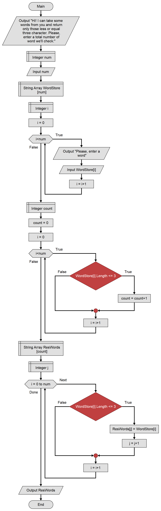

# GeekBrains. Разработчик. Контрольная работа по основному блоку
Привет! Это итоговая работа по основному курсу программы «Разработчик» от GeekBrains. Сама программа содержится в файле **Program.cs**, там же содержатся комментарии на английском. Здесь же я прокомментирую ход решения и ещё кое-какие нюансы.

## Условия задачи
Написать программу, которая из имеющегося массива строк формирует новый массив из строк, длина которых меньше, либо равна 3 символам. Первоначальный массив можно ввести с клавиатуры, либо задать на старте выполнения алгоритма. При решении не рекомендуется пользоваться коллекциями, лучше обойтись исключительно массивами.

Примеры: 
*[“Hello”, “2”, “world”, “:-)”] → [“2”, “:-)”] 
[“1234”, “1567”, “-2”, “computer science”] → [“-2”] 
[“Russia”, “Denmark”, “Kazan”] → []*

## Блок-схема
В файле **Flowchart.png** можно найти примерную (упрощённую) схему решения задачи

Схему я рисовала в программе [Flowgorithm](http://www.flowgorithm.org/), которая рисует блок-схему и одновременно пишет псевдокод на «всех языках сразу», так что кое-каких спцеицифических возможностей языка С# в ней просто нет. Можно, например, 